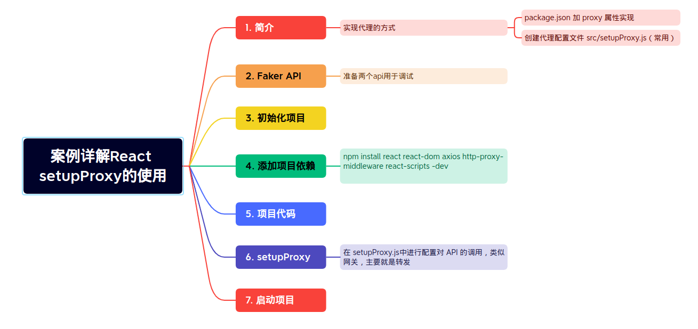

## React setupProxy的使用

### 参考

- [案例详解React setupProxy的使用](https://juejin.cn/post/7102982599848493063)
- [faker.js 官方文档](https://fakerjs.dev/guide/)
- [faker.js 使用演示demo](https://github.com/zjy4fun/faker-api-demo)