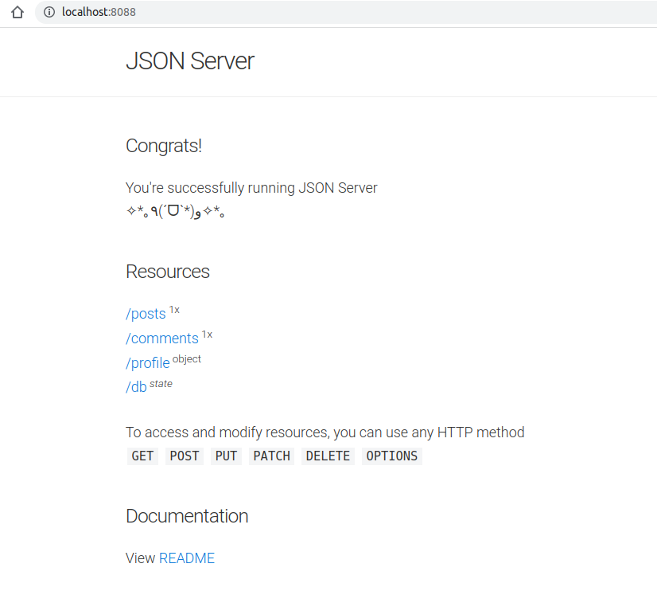

## Docker快速部署Faker JSON Server

### 简介

JSON-server 是一个 node 模块，运行 express 服务器，可以指定一个 json 文件作为 api 的数据源，可以非常快地创建一个 REST API。

这里使用基于 JSON-server 做的成型镜像，它可以快速启动一个 REST API。

### 部署

```bash
docker run -d -p 8088:80 -v /home/z/Desktop/a/react-proxy-demo/packages/docker-json-server/articles.json:/data/db.json clue/json-server
```

创建 JSON 数据

```json
{
  "posts": [{ "id": 1, "title": "json-server", "author": "typicode" }],
  "comments": [{ "id": 1, "body": "some comment", "postId": 1 }],
  "profile": { "name": "typicode" }
}
```

### 访问 JSON server

localhost:8088



成功访问！

### 访问 API

通过不同的 http method 访问 API 会产生不同的行为：
- get       获取
- delete    删除
- post      添加
- put       修改

示例见 postman.json 

### 参考

- [Docker快速部署Faker JSON Server](https://juejin.cn/post/7102022100705574926)
- [composerize(docker命令转docker-compose.yml)](https://github.com/magicmark/composerize)

